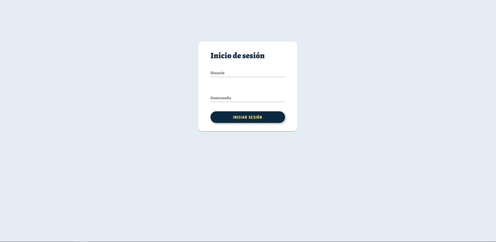
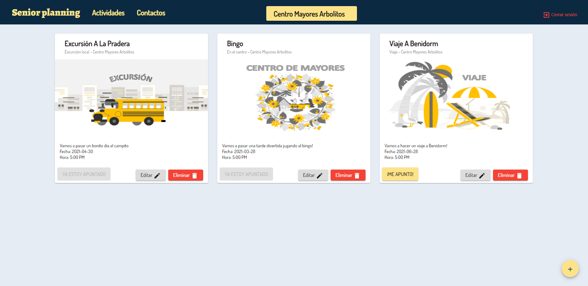
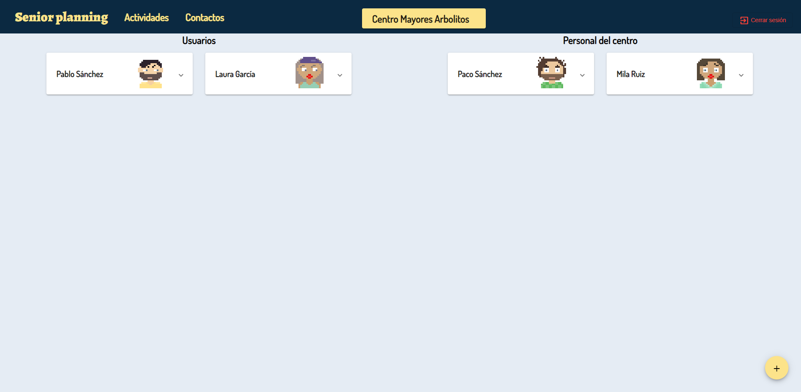

# SENIOR PLANNING

## DESCRIPTION
This project is focused to manage elderly centers. There are two roles: workers (the personal of the center) and clients (old people registered in the center).
Workers can register users to the platform. Also, workers can add, edit or remove activities from their center. Clients have access to the activities of the center and they can sign up for the activies.

## PROJECT STRUCTURE
The project has three microservices:

- user-server
- activities-server
- center-server

Also, there is an edge-service that will communicate with all of them and an eureka-server to discover and facilitate the communication between microservices.

There is also an instance of MySQL Server deployed in Google Cloud. The access configuration is in application.properties of each microservice.

### DEPENDENCIES
To execute this project you need:

- Nodejs + npm
- Angular (optional)
- Java
- Maven

## ORDER OF EXECUTION
1. You have to execute the command ```mvn: spring-boot:run``` to start the services in this order: 
   1. eureka-server
   2. micro-services
   3. edge-server
   
2. Open finalProjectAngular
3. Run ```npm i``` to install all dependencies. 
4. Run ```npm start``` or ```ng serve``` (if you have Angular installed globally). Navigate to http://localhost:4200/.

## ENJOY

Introduce the following credentials to enjoy the project:

If you want to be a worker:
- User: enrique01
- Password: 123456

If you want to be a user:
- User: julito
- Password: 123456

## APPLICATION VIEWS





